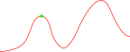
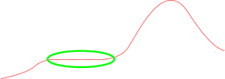
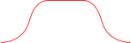

# Introduzione all'intelligenza artificiale

## Oltre la ricerca classica

In questa fase si analizzeranno una categoria di problemi con caratteristiche più vicine ai problemi reali, rilassando alcune assunzioni che sono state fatte riguardo all'ambiente.

### Ricerca locale

Per i problemi affrontati finora, si sono analizzati algoritmi in grado di effettuare una ricerca in modo sistematicon nello spazio degli stati, memorizzando il percorso e le scelte effettuate durante la ricerca, producendo un risultato consistente di un _percorso_ soluzione. Ci sono problemi però di cui non interessa il percorso effettuato per giungere ad uno stato _goal_ besì è interessante solamente trovare tale stato.
Sotto queste premesse si dovrà considerare una diversa classe di algoritmi, tali che non tengono conto del percorso effettuato durante il processo di ricerca.

Gli algoritmi di ricerca locale operano considerando un **nodo corrente** e man mano si muovono dal nodo corrente al vicino adottando diverse strategie.

I vantaggi che derivano dall'impego di questo tipo di algoritmi sono principalmente lo scarso utilizzo della memoria e la capacità di trovare solitamente una _buona_ soluzione in tempi _accettabili_ in uno spazio degli stati in cui una ricecrca sistematica non è fattibile.

Oltre che per la ricerca di uno stato _goal_, gli algoritmi di ricerca locale possono essere utili per problemi di ottimizzazione, in cui si cerca la soluzione migliore data una certa funzione di obiettivo calcolata sugli stati [[Vedi](Ricerca locale per problemi CPS)], infatti tipicamente gli algoritmi di ricerca locale usano una **formulazione a stato completo**.

Si introduce il concetto di **panorama degli stati**, di cui si dilineano _posizione_ (definita dallo stato) e _altitudine_ (definita dalla funzione euristica di costo o dalla funzione obiettivo).
Se si identifica l'_altitudine_ con il costo (o il valore della funzione euristica del costo) allora si circherà il **punto di minimo globale** all'interno del panorama degli stati; al contrario, se si identifica l'_altitudine_ con la funzione obiettivo, allora si dovrà cercare il **punto di massimo globale**.

Un algoritmo di ricerca locale è **completo** se trova sempre uno stato _goal_, mentre si dice **ottimo** se lo stato trovato è un punto di minimo/massimo globale.

#### Ricerca hill-climbing

L'algoritmo di ricerca locale **hill-climbing** (versione _steepest-ascent_), è sintetizzato dal seguente codice:

```shell
function HILL-CLIMBING(problem) returns a state that is a local maximum
    current ← MAKE-NODE(problem.INITIAL-STATE) 
    while true
        neighbor ← a highest-valued successor of current
        if neighbor.VALUE ≤ current.VALUE then 
            return current.STATE 
        current ← neighbor
```

Come si può facilmente comprendere dal codice, l'algoritmo esegue un loop che sposta il nodo corrente nella direzione di valori sempre crescenti fintanto che ne trova. Qualora si trovino più stati _vicini_ con il cui valore di funzione obiettivo è quello massimo   (rispetto agli altri stati _vicini_), viene scelto uno di loro in modo casuale. L'algoritmo termina quando raggiunge un stato che rappresenta un punto di massimo locale.

L'algoritmo **hill-climbing** può essere definito _gready_ in quanto non considera eventuali conseguenze degli spostamenti che effettua. Nonostante questo si rivela efficace in molte applicazioni.
Questo algoritmo tuttavia spesso non trova la soluzione ottima bensì accade che si blocchi nelle seguenti situazioni:

- **Massimo locale**: Dato $S_{MAX}$ uno stato la cui valutazione della funzione obiettivo rappresenta un punto di massimo locale nel panorama degli stati. Si otterrà che nessuno stato raggiungibile da $S_{MAX}$ avrà una valutazione più alta perciò l'algoritmo terminerà.
  

- **Plateaux**: Un plateaux è un insiemi si stati adiacenti con lo stesso valore della funzione euristica di costo o della funzione obiettivo, rappresentabile come un area piatta nel grafico che rapresenta il panorama degli stati.
  

- **Cresta**: Reapprenta una sequenza di massimi locali non adiacenti direttamente.

Il verificarsi di tali situazioni dipende principalmente dalla "forma" del panorama degli stati.

Applicando l'algoritmo a vari problemi emerge che la procedura spesso si blocca proprio a causa di una delle situazioni presentate sopra.
Effettuando una semplice modifica all'operatore di disuguaglianza nella guardia del comando if alla 5° riga, utlizzando invece che $\leq$ un $<$, si ottiene un algoritmo che si blocca considerevolmente meno frequentemente, in virtù del fatto che riesce a fare movimenti "di lato", verso stati con la medesima valutazione quindi in situazioni come plateaux. 

Detto ciò è importante evidenziare il fatto che, con questa modifica, è possibile incorrere in loop infiniti qualora il controllo dell'algoritmo prendesse in considerazione stati appartenenti ad aree piatte di massimo locale.



Una possibile soluzione a questo tipo di situazioni può essere quella di concedere un numero massimo di spostamenti "di lato" consecutivi.

##### Hill-climbing stocastico

Una variante dell'algoritmo **hill-climbing**. Questo sceglie casualmente una fra le possibili mosse verso stati con valutazione più alta, eventualmente assegnando a ciascuna mossa una probabilità direttamente proposzionale alla differenza fra la valutazione dello stato corrente e la valutazione dello stato adiacente considerato.

##### Hill-climbing con prima scelta

Un'altra veriante dell'algoritmo **hill-climbing**. Questo genera iterativamente e in modo casuale la lista degli stati successori, finché non ne viene generato uno che ha una valutazione migliore dello stato corrente, a quel punto l'algoritmo fa una mossa verso quel nodo.
Questa variante ottiene buoni risultati specialmente in spazi degli stati molto connessi dove la lista degli stati adiacenti può essere molto lunga (potenzialmente infinita).

##### Random restart hill-climbing

Questa variante dell'algoritmo **hill-climbing**, prevede che qualora l'algoritmo di base fallisca nel trovare uno stato _goal_, si generi casualmente un nuovo stato iniziale e, a partire da quest'ultimo, si esegua di nuovo l'algoritmo.

Questa variante può essere considerata completa puoiché potenzialmente esplora tutti gli stati anche solamente per il fatto che potrebbe casualmente generare uno stato *goal*.

#### Tempra simulata (Simulate anealing)

Come si è visto, l'algoritmo **hill-climbing** non produce mai mosse che abbassano la valutazione dello stato corrente, questo fatto porta alla conclusione che l'algoritmo non sia completo, in qunto, come detto, potrebbe incappare in massimi locali. Al contrario una visita randomica (**random walk**) degli stati è potenzialmente completa ma estremamente inefficente. 
Con l'obettivo di mantenere la completezza derivante dalla **random walk** e l'efficenza dell'**hill-climbing** l'algoritmo `SIMULATED-ANNEALING`, concede inizialmente mosse che diminuiscono la valutazione dello stato corrente (_mosse peggiorative_) con una probabilità proporzionale alla differenza fra l'attuale valutazione dello stato corrente e quella dello stato adiacente in considerazione ($\Delta E$). La probabilità di fare _mosse peggiorative_ inoltre, diminusce con l'avanzare dell'algoritmo ($T$).

```shell
function SIMULATED-ANNEALING(problem,schedule) returns a solution state 
    inputs: problem, # a problem
            schedule, # a mapping from time to “temperature”
    current ← MAKE-NODE(problem.INITIAL-STATE) 
    for t =1 to ∞ do
        T ← schedule(t)
        if T = 0 then 
            return current
        next ← a randomly selected successor of current # viene generato
        ΔE ← next.VALUE – current.VALUE
        if ΔE > 0 then # Una mossa migliorativa viene sempre accettata
            current ← next
        else 
            current ← next only with probability e^(ΔE/T)
```

In altri termini:

> <small>Grazie a [fexed](https://github.com/fexed)</small>
> 
> **Tempra simulata**
> Ad ogni passo si sceglie un successore a caso:
> 
> > Se migliora lo stato corrente, viene espanso.
> > 
> > Se non lo migliora (caso in cui $\Delta E=f(n')-f(n) < 0$ ), quel nodo viene scelto con probabilità $p = e^{\frac{\Delta E}{T}}$, con $p$ ovviamente $0≤p≤1$
> > 
> > Si genera un numero a caso $0\le r \le 1$ 
> > 
> > > se questo $r < p$ il successore viene scelto, altrimenti no
> 
> Tenendo conto che:
> 
> - $p$ `e inversamente proporzionale al peggioramento  
> 
> - $T$ (temperatura) decresce al progredire dell’algoritmo (quindi anche p) secondo un piano definito.
> 
> - Col progredire, rende improbabili le mosse peggiorative.
> 
> La probabilità di una mossa in discesa diminuisce col tempo, e l’algoritmo si comporta sempre di più come Hill-Climbing.
> 
> Se $T$ viene decrementato abbastanza lentamente, con probabilità tendente ad $1$ si raggiunge la soluzione ottimale.
> 
> **Parametri** 
> Valore iniziale e decremento di $T$ sono parametri.  
> I valori per $T$ sono determinati sperimentalmente: il valore iniziale di $T$ è tale che per valori medi di $\Delta E \rightarrow p = e^{\frac{\Delta E}{T}} ≅ 0.5$  

#### Local beam search

L'algoritmo **local beam search** tiene traccia di $k$ stati invece che solo quello corrente.
Inizialmente vengoono generati casualmente $k$ stati $[S_1, S_2, ..., S_k]$; ad ogni passo vengono espansi tutti i $k$ stati e vengono considerati i tutti i relativi successori.

$$
[S_1, S_2, ..., S_k] + [[S_{(1, 1)}, ..., S_{(1, l_1)}]_{1}, ... [S_{(k, 1)}, ...,S_{(k, l_k)}]_{k}] \\
\text{con}\;S_{(i, j)} = j\text{-esimo successore di }S_i\\
\text{con}\; l_i = \text{numero di successori di } S_i
$$

 Se uno fra questi è uno stato _goal_, l'algoritmo termina resituendo come risultato lo stato _goal_ trovato, altrimenti seleziona i $k$ stati migliori dalla lista risultante e ricomincia l'iterazione.

A prima vista potrebbe sembrare che e random restart **hill-climbing** e **local beam search** siano lo stesso algoritmo, quando in realtà il primo esegue in modo "isolato" $k$ ricerche distinte (anche *parallelamente*), mentre nel secondo si segue una direzione che è influenzata dal prodotto di tutte le $k$ espansioni.

#### Local beam search stocastico

 La versione dell'algoritmo **local beam search** appena presentata può incorre in situazioni nelle quali i $k$ stati di cui si tiene traccia, siano localizzati tutti molto "vicini" fra loro, riducendosi in questo modo ad una versione solamente più costosa in spazio dell'**hill-climbing**.

Nella sua variante stocastica, come fatto per l'**hill-climbing stocastico**, l'algoritmo local beam search sceglie in modo casuale $k$ fra i successori espansi con una probabilità maggiore per i successori con una valutazione più migliore.

#### Algoritmi Genetici

Gli **algoritmi genetici** di ricerca locale sono una variante dell'algoritmo **local beam search**, dove gli stati successori sono generati a partire da due fra i $k$ stati di cui si tiene traccia (*popolazione*).

**Procedimento**:

Assumendo che ogni stato abbia una rappresentazione finita composta da simboli di un alfabeto finito (e.g. una stringa di 0 o 1).

- L'algoritmo seleziona in modo stocastico gli stati genitori in base alla funzinone di valutazione (funzione _fitness_).

- Per ogni coppia di genitori viene stabilito (anche qui in modo stocastico oppure predefinito) un punto di _crossover_ all'interno delle loro rappresentazioni (lo stesso per entrambi).

- Si effettua il _crossover_, ossia vengono incrociate le parti delle rappresentazioni degli stati genitori, divise dal punto di selezione scelto nella fase precedente (seguendo uno schema a X ). 

- Si introduce casualmente una variazione nelle rappresentazioni appena generate.

Da un'analisi di questa categoria di algoritmi, possiamo intuire una somiglianza con l'algoritmo di **tempra simulata**, in quanto anche per gli **algoritmi genetici**, assistiamo a mosse fra stati molto diversi fra loro nelle iterazioni iniziali della procedura, per poi  convergere verso una area dello spezio degli stati sempre più circoscritta.

Come per l'algoritmo **stocastic local beam search**, gli algoritmi genetici combinano la tendenza della ricerca verso stati con valutazioni migliori propria dell'algoritmo **hill-climbing**, con la stocasticità della **random walk** e la condivisione di informazioni fra ogni  ramo di sviluppo della ricerca.


### Ricerca locale in spazi continui

Fatta eccezione per gli algoritmi **hill-climbing con prima scelta** e **tempra simulata**, finora si sono considerati solamente algoritmi per la risoluzione di problemi situati in spazi discreti; questo perché gli algoritmi visti non gesticono spazi con fattore di diramazione infinito.

Assumeremo che gli stati definiti per questa classe di problemi, siano rappresentabili con un vettore $x_i$ di lunghezza $n$ ($x_i \in \mathbb{R}^n$); in altri termini possiamo dire che gli stati sono definibili con $n$ variabili. In questo scenario, _muoversi_ fra gli stati si traduce in cambiare valori per un sottoinsieme degli $n$ componenti del vettore; tale operazione produce uno stato diverso.
Si avrà inoltre una funzione di valutazione $f$ definita su vettori $\mathbb{R}^n$.

Una possibile soluzione per la grstione di uno spazio degli stati contuinui, è quella di *discretizzare* lo spazio degli stati raggiungibili dal nodo corrente rappresentato da $\vec{x}$ di una certa quantità $\pm\delta$ per ogni componente del vettore; in questo modo, si avranno $2n$ possibili successori per ogni nodo:

$$
2\;(+\text{ o }-) \times n\;(\text{componenti di un vettore } \mathbb{R}^n)
$$

Se la funzione di valutazione $f$ è continua e differenziabile in $\mathbb{R}^n$, per ogni vettore $\vec{v} \in \mathbb{R}^n$ è possibile definire il **gradiente**, ossia un vettore $\nabla f(\vec{v})$ che suggerisce la direzione da prendere nella ricerca (come una "bussola") e un indice di quanto cresce la funzione di valutazione per gli stati in quella specifica direzione. 
Il **gradiente** è dato dalla seguente espressione:

$$
\nabla f(\vec{x}) = \left(\frac{\delta f}{\delta x_1}, ..., \frac{\delta f}{\delta x_n}\right) \\ \text{con } \frac{\delta f}{\delta x_i} \text{derivata parziale rispetto a } x_i \text{ calcolata nel punto } \vec{x}
$$

Va da sé che il gradiente calcolato in un punto di massimo o minimo locale risulta sempre uguale a $0$.

Detto ciò, è possibile esegure una procedura di ricerca del tutto simile a quella definita dall'algoritmo **hill-climbing**, calcolando il nodo successore $\vec{x}_{succ}$ a partire dal nodo corrente $\vec{x}$, utilizzando il **gradiente** tramite la seguente formula:

$$
\vec{x}_{succ} = \vec{x} \pm \eta \nabla f(\vec{x}) \\
\text{• }+\text{ se si cerca un massimo} \\
\text{• }-\text{ se si cerca un minimo}
$$

dove $\eta$ è una piccola costante (chiamata anche *step size*) che ridimensiona l'ampiezza dello spostamento.

# <u>TODO</u>


---

## Giochi con avversario

La tipologia di problemi identificata come _Giochi con avversario_ comprende tutti quei problemi che che comprendono un ambiente **multi-agente**, nel quale l'agente dovrà considerare anche le azioni degli alti altri agenti.
Di seguite verranno considerati problemi, che verranno chiamati _giochi_, che coinvolgono solamente due agenti i quali effettuano le proprie azioni a turno e per cui la relazione fra gli agenti all'interno dell'ambiente sono di tipo competitivo. I problemi di questo tipo saranno situati in ambienti deterministici e completamente osservabili.
Si analizzeranno i cosiddetti _giochi_ a **somma zero**, termine che però non indica come si potrebbe pensare, che valori di utilità dello stato per i due agenti all fine del _gioco_ saranno uguali in modulo e opposti in segno ma che la somma dei valori di utilità dello stato (finale) di tutti gli agenti è la stessa per ogni istanza del _gioco_.
Per esempio gli scacchi sono un gioco a somma zero anche con questa definizione della funzione utilità:

$$
1 + 0\;\;\mathsf{MAX}\;vince\;e\;\mathsf{MIN}\;perde\\
0 + 1\;\;\mathsf{MAX}\;perde\;e\;\mathsf{MIN}\;vince\\
1/2 + 1/2\;\;\mathsf{MAX}\;e\;\mathsf{MIN}\;pareggiano\\
$$

Di seguito identificheremo i due agenti rispettivamente con i nomi $\mathsf{MIN}$ e $\mathsf{MAX}$, si assumerà che $\mathsf{MAX}$ faccia la prima mossa e che il *gioco* prosegua a turni finché non si giunge alla fine. Un *gioco* può essere definito formalmente dai seguenti elementi:

- $S_0$ : Lo stato iniziale

- `PLAYER(s)` : Definisce quale agente deve muovere dato uno stato

- `ACTIONS(s)` : Definisce le mosse legali dato uno stato

- `RESULT(s,a)` : Il **modello di transizione**, definisce lo stato che viene raggiunto dopo che viene applicata l'azione `a` a partire dallo stato `s`.

- `TERMINAL-TEST(s)` : Il **test di terminazione**, che restituisce `true` se il gioco nello stato `s` si considera terminato, `false` altrimenti.

- `UTILITY(s,p)` : La **funzione utilità**, definisce il valore numerico corrispondente allo stato <u>finale</u> `s` (non definita su stati intermedi) e relativo all'agente `p` ($\mathsf{MIN}$ o $\mathsf{MAX}$,).

In questo genere di problemi, solitamente lo spazio di ricerca è molto vasto, per cui spesso non è possibile fornire una decisione ottima, specialmente in virtù del fatto che nelle applicazioni reali, il tempo a disposizione è limitato. Per questo motivo si rende necessaria una strategia per prendere decisioni che siano il più _buone_ possibile nel minor tempo _possibile_. 

^
|

# TODO

---

## Problemi di soddisfacimento di vincoli

Un problema di soddisfacimento di vincoli consistste di tre componenti $X$, $D$, $C$ :

- $X$ : L'insieme delle variabili $\{X_1, X_2, ..., X_n\}$

- $D$ : L'insieme dei domini delle variabili $\{D_1, D_2, ..., D_n\}$

- $C$ : L'insieme dei vincoli che difiniscono le possibili conmbinazioni _consistenti_ di valori

Ogni dominio $D_i$ consiste in un inseme di valori ammissibili per la variabile $X_i$ .

Ogno vincolo $C_i$ consiste in una coppia $<ambito , relazione>$ dove $ambito$ è la tupla delle variabili coinvolte nella relazione, e $relazione$ è la relazione che difinisce i valori che le variabili coninvolte possono assumere. Una relazione può essere rappresentata esplicitamente come una lista di tuple di valori che soddisfano il vincolo oppure come una relazione astratta che supporta due operazioni:

- Test di inclusione di una certa tupla nella relazione

- Enumerazione dei membri della relazione

Ogni stato in un problema CSP è definito da un assegnamento di valori ad alcune o tutte le variabili $\{X_i = v_i, X_j = v_j, ...\}$. Un assegnamento che non viola nessun vincolo è chiamato **_consistente_** o **_assegnamento legale_**. Un assegnamento ***completo*** è un assegnamento nel quale ad ogni variabile di $X$ viene associato un valore; al contrario un assegnamento ***parziale*** è un assegnamento nel quale ad almeno una variabile in $X$ non viene associato nessun valore.

### Domini

Il dominio delle variabili in un problema di CSP può essere **discreto** (_finito_/_infinito_) oppure **continuo**. Nel caso di domini discreti infiniti o continui, è importante sottolineare che non è sempre possibile descrivere le relezioni dei vincoli tramite la semplice enumerazione delle possibili combinazioni dei valori. Sarà necessario quindi adottare un linguaggio che possa asprimere in modo implicito le relazioni.

### Vincoli

Il tipo di vincolo più semplice è detto **_unario_**, nel quale l'$ambito$ coinvolge solamente una variabile di $X$; per esempio  $\langle(X_i), X_i \neq v_i\rangle$ per qualche $v_i \in D_i$.  
Un vincolo di tipo binario coinvolge invece due variabili; per esempio $\langle(X_i, Y_j), X_i \neq Y_j\rangle$.  
Possono essere descritti vincoli di ordine più alto: _ternari_, ecc...  
In generale, un vincolo che coinvolge un numero arbitrario di varibili è detto **_globale_**, che contrariamente a quanto suggerisce il nome, non necessita di includere _tutte_ le variabili.

#### Consistenza

Concetti molto utili in fase di ricerca in un problema CSP, sono quelli di **_consistenza di nodo_** e ***consistenza di arco***, che permettono di ridurre lo spazio di ricerca riducendo i domini delle variabili.

###### Consistenza di nodo

Una variabile $X_i$ si dice *node-consistent* se tutti i valori del dominio $D_i$ di $X_i$ soddisfano i vincoli unari relativi a $X_i$

###### Consistenza di arco

Una variabile $X_i$ si dice _arch-consistent_ se tutti i valori del dominio $D_i$ di $X_i$ soddisfano i vincoli binari relativi a $X_i$. In altri termini $X_i$ è _arch-consistent_ rispetto ad un'altra variabile $X_j$ se per ogni valore nel dominio $D_i$ di $X_i$, esiste almeno un valore nel dominio $D_j$ di $X_j$ tale per cui il vincolo sull'arco $(X_i, X_j)$ è soddisfatto.

### Strategie per problemi CSP

La risoluzione di problemi CSP può essere affrontata adottando diverse strategie (anche contemporaneamente). Per i problemi affrontati fin'ora infatti, si procedeva solamente effettuando una ricerca nello spazio degli stati per trovare lo stato _goal_; è invece possibile trattare problemi di CSP adottando tre principali tecniche:

- **Ricerca**: Utilizzare euristiche specifiche per questa classe di problemi

- **Inferenza**: Fare delle assunzioni basate sui vincoli che portano a restringere i domini e quindi a limitare la ricerca.

- **Backtracking**: Riassegnare il valore ad un insieme di variabili dopo che un tentativo di assegnamento si è rivelato inconsistente.

#### Ricerca

Tipicamente è possibile formulare i problemi CSP in due modi distinti: in modo ***incrementale*** oppure a ***stato completo***.

###### Formulazione incrementale

Con una formulazione di tipo incrementale lo stato iniziale corrisponde ad un assegnamento vuoto, e si procede man mano assegnando valori alle varibili.

###### Formulazione a stato completo

Con una formulazione a stato completo invece, lo stato iniziale corrisponde ad un assegnamento di partenza (casuale?) completo e vengono risolti man mano i vincoli che risultano violati.

Assumendo di adottare una formulazione incrementale per un problema di CSP, si sottolinea che la profondità massima di ricerca è data dal numero $n$ delle variabili del problema.

Ingenuamente si potrebbe effettuare una ricerca nello spazio degli stati tenendo conto anche l'ordine delle varibile che vengono  considerate ad ogni passo, ottenendo il numero delle foglie dell'albero di ricerca sarà dato da:

$$
(n\cdot d)\cdot [(n-1)\cdot d] \cdot ...  \cdot (1\cdot d) = n! \cdot d
$$

Si nota facilmente però, che gli assegnamenti possibili sono solamente $d^n$, una formulazione del genere infatti, ignora una importante proprietà comune a tutti i problemi CSP: la ***commutatività***.  
Un problema si dice _commutativo_ se l'ordine con cui vengono applicate le azioni possibili non influisce sul risultato prodotto.  
I problemi CSP sono _commutativi_ perché assegnando valori ad un sottoinsieme di varibili, si ottiene il medesimo assegnamento parziale, a prescindere dall'ordine con cui si sono assegnati i valori. 

Con questa considerazione, si ottiene che il numero delle foglie dell'albero di ricerca è dato semplicemente da $d^n$.

##### Strategia di ricerca

Per affrontare una ricerca nello spazio degli stati appena descritto, risulta conveniente adottare una ricerca in profondità **DF**, che considera una sola variabile alla volta e adotta una strategia di backtracking quando non esistano valori consistenti da assegnare ad una variabile considerato l'assegnamento generato fino a quel punto.  
Viene infatti eseguito un controllo anticipato della violazione dei vincoli poiché è inutile procedere fino alla fine e poi controllare; è conveniente fare backtracking non
appena si scopre che un vincolo è stato violato.

Considerato quanto detto, abbiamo il seguente algoritmo di ricerca `BACKTRACKING-SEARCH` per problemi CSP:

```
function BACKTRACKING-SEARCH(csp) → a solution, or failure: 
    return BACKTRACK({ }, csp)

function BACKTRACK(assignment,csp) → a solution, or failure:
    if assignment is complete then 
        return assignment
    var ← SELECT-UNASSIGNED-VARIABLE(csp)
    for each value in ORDER-DOMAIN-VALUES(var,assignment,csp) do
        if value is consistent with assignment then 
            add {var = value} to assignment 
            inferences ← INFERENCE(csp,var,value) 
            if inferences != failure then
                add inferences to assignment
                result ← BACKTRACK(assignment, csp) 
                if result != failure then
                    return result
        remove {var = value} and inferences from assignment
    return failure
```

Nel caso dei problemi CSP non vengono sfreuttate conoscenze del problema specifico per migliorare la ricerca come si è invece fatto per i problemi di ricerca visti fin'ora. I problemi di CSP si risolvono efficientemente a prescindere dalla conoscenza del problema specifico. Tuttavia possono essere specificate in modi più o meno efficenti le  funzioni che si sono introdotte in modo generico:

- `SELECT-UNASSIGNED-VARIABLE`: per scegliere la variabile da prendere in considerazione durante un'iterazione.

- `ORDER-DOMAIN-VALUES`: per scegliere il valore da provare per la variabile scleta durante un'iterazione

- `INFERENCE`: per scegliere quali _inferenze_ possono essere fatte sulla base dell'assegnamento assunto fino ad una certa iterazione

- `BACKTRACK`: quando si ottiene un assegnamento inconsistente, si cerca di trovare una tecnica per evitare di ottenere di nuovo lo stesso assegnamento

###### Ordinamento di variabili

Data una qualsiasi iterazione dell'algoritmo `BACKTRACKING-SEARCH` ed un assegnamento parziale, pittosto che considerare le variabili in ordine casuale, si rivela efficiente scegliere la variabile più vincolata ossia la variabile con il minor numero di valori legali accettabili per l'assegnamento corrente: **MRV** (*Minimum Remaining Values*).

Una seconda euristica detta "_del grado_", spesso considerata a parità di MRV, suggerisce di scegliere la variabile più vincolante (o di _grado_ maggiore) ossia coinvolta in più vincoli con altre variabili.

###### Ordinamento di valori

Data una qualsiasi iterazione dell'algoritmo `BACKTRACKING-SEARCH`, un assegnamento parziale e scelta opportunamente una variabile da prendere in considerazione, si dimostra efficiente scegliere, fra i valori possibili, quello che esclude meno valori per le altre variabili direttamente collegate con la variabile selezionata; questo in virtù del fatto che  è meglio valutare prima un assegnamento che ha più probabilità di successo.

Si sottolinea il fatto che se si volesse trovare tutte le soluzioni possibili, l’ordine con il quale si sceglie il valore non sarebbe importante; stessa considerazione per i problemi che non hanno soluzioni.

###### Inferenza

Con l'obiettivo di ridurre il più possibile lo spazio di ricerca, ad ogni iterazione è opportuno effettuare una procedura di inferenza che sperabilmente riduce i domini dei delle variabili ancora da assegnare. 

***Propagazione di vincoli***

Si tratta di una procedura che viene eseguita prima della ricerca vera e propria. Si effettua una verifica globale delle consistenze sia di nodo che di arco. Ogni volta che il dominio di una variabile $X_i$ viene ridotto, vengono ricalcolate le consistenze per ogni variabile coinvolte in almeno un vincolo con $X_i$; la procedura prosegue finché i domini delle variabili non possono essere ulteriormente ridotti. Successivamente si inizia la procedura di ricerca.

***Forward-Checking***

Ogniqualvolta viene assegnato un volore ad una variabile $X_i$, si calcola la relativa _node-consistency_ locale, quindi per ogni variabile $X_j$ non ancora assegnata e coinvolta in almeno un voncolo insieme a $X_i$, vengono rimossi tutti i valori inconsistenti dal dominio $D_j$.

###### Backtracking

Il backtracking è il meccanismo utilizzato durante la ricerca con il quale viene rimosso un assegnamento di valore per una veriabile  $\{X_i=v_i\}_{(1)}$,  in seguito alla verifica del fatto che almeno una variabile $X_j$ non ancora assegnata, non ammette valori consistenti.
L'efficenza della ricerca può dipendere da quale essegnamento si decide di ritrattare.

***Backtracking cronologico***

Con una politica di backtracking cronologico, non appena si verifica che il dominio di una variabile $X_i$ risulta vuoto (non ammette valori consistenti), si rimuove l'ultimo assegnamento fatto seguendo l'ordine cronologico.

***Backtracking intelligente***

Un approccio più efficente per fare backtracking, dovrebbe essere quello di scegliere l'assegnamento da rimuovere che in effetti risolva l'inconsistenza.
Data la variabile $X_i$, consideriamo l'**insieme dei conflitti** come l'insieme delle variabili già assegnate conviolte nei vincoli che, dato l'assegnamento parziale attuale, hanno reso vuoto il dominio di $X_i$. Il metodo del **backjumping** effettua un backtracking all'assegnamento più recente all'interno dell'insieme dei conflitti.

### Ricerca locale per problemi CPS

Le tecniche di ricerca locale viste si rivelano utili anche nel contesto di problemi CPS. Per questa strategia di ricerca si adotta una formulazione a [stato completo](######formulazione-a-stato-completo), ossia si fornisce un assegnamento completo inisziale e si procede man mano con la modifica dei singoli assegnamenti al fine di rendere soddisfatti tutti i vincoli del problema. In questi casi si parla anche di _riparazione euristica_.

#### Euristica Min-conflicts

Dato quindi un assegnamento completo iniziale, verosimilmente inconsistente che quindi viola diversi vincoli, viene scelta a caso una variabile $X_i$ il cui assegnamento viola uno o più vincoli. Si procede riassegnando il valore per $X_i$ segliendo, fra tutti i valori possibili in $D_i$ quello che causa il minor numero di vincoli violati.
A questo punto, se l'assegnamento attuale è ancora inconsistente si ripete il procedimento.

Di seguito si ha l'algoritmo che implementa la ricerca locale per un problema CPS con adottando una euristica di riassegnamento di tipo ***Min-conflicts***.

```shell
function MIN-CONFLICTS(csp,max-steps) returns a solution or failure inputs: 
    csp # a constraint satisfaction problem
    max steps # the number of steps allowed before giving up
    current # an initial complete assignment for csp 
    for i=1 to max-steps do
        if current is a solution for csp then 
            return current
        var ← a randomly chosen conflicted variable from csp.VARIABLES
        value ← the value v for var that minimizes CONFLICTS(var,v,current,csp) 
        set var = value in current
    return failure
```